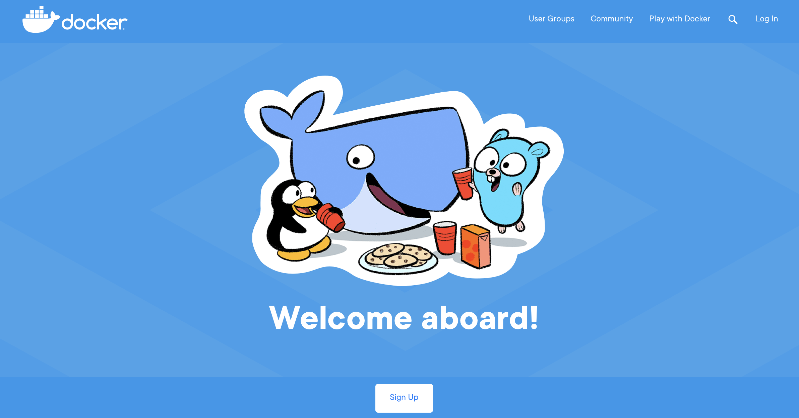
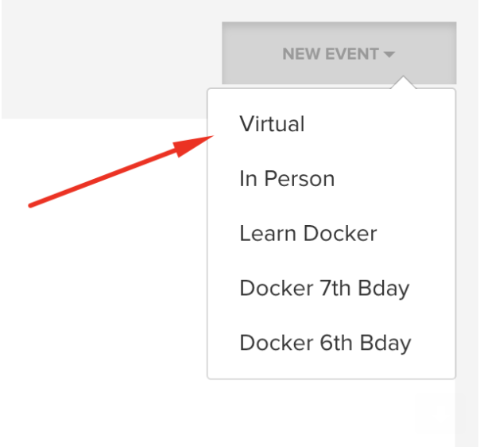

# Set up Bevy Virtual Event Page

### Step #1 Open [events.docker.com](https://events.docker.com) on your browser

### Ste #2 Select your local chapter

Once you successful login, click on "Dashboard"

### Step #3 Select "virtual event" option from the top-down menu as shown below

You will need to supply title, event description, schedule and agenda.

### Step #4 Choose "Bevy Virtual" option from the drop-down menu under Virtual Event Platform

### Step #5 Click on "Publish".

[Step 4 - Sending Confirmation Email](../email/)
